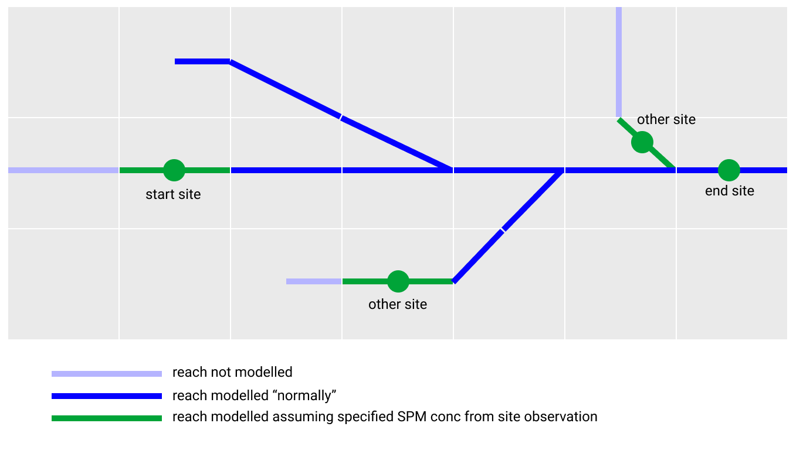
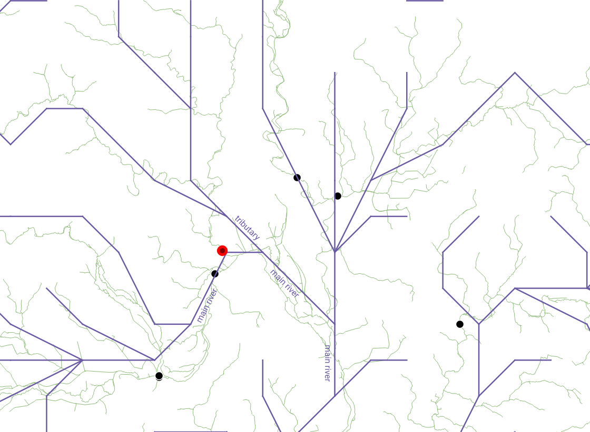

# Suspended particulate matter calibration

The model can be run in "calibration" mode to enable the input of suspended particulate matter (SPM) as upstream boundary conditions, and the comparison of modelled SPM concentrations vs observed SPM concentrations at a downstream point.

The calibration works as in the following schematic. The green circles show the location of the sampling sites, and the goal is to provide SPM concentrations at the "start site" and run the model downstream to enable comparison between observed and modelled concentrations at the "end site". In going downstream, the model passes a number of tributaries. If a sampling site is available on this tributary, the model uses observed concentrations from this site and models downstream from this. If there is no sampling site, the model runs the entire tributary, i.e. from the headwater. (Actually, the model still runs for the entire catchment when in calibration mode, but model outputs for reaches upstream from sampling sites should be disregarded.)



## Running the model in calibration mode

The model requires a config file to run, the location of which is passed as a command line argument when the executable is run:

```shell
$ /path/to/model.exe /path/to/config.nml
```

The file is a Fortran namelist file, and examples are given in [config/](../config/). Use the `&calibrate` section of this file to provide calibration specific information:

```
&calibrate
calibration_run = .true.
site_data = "data/thames/spm-sampling-sites.csv"
start_site = "TC5"
end_site = "TC16"
other_sites = "TC1", "TC3", "TC4", "TC8", "TC9", "TC10", "TC11", "TC12", "TC14", "TC15", "TC17" 
/
```

- The `calibration_run` variable tells the model whether to run in calibration mode or not. If this is set to false, the remaining variables have no effect.
- `site_data` tells the model where to find the list of sampling sites and their data. The format of this is covered below.
- `start_site` is the unique code to identify the start site from the `site_data` file.
- `end_site` is the unique code to identify the end site from the `site_data` file.
- `other_sites` is a list of other sites from the `site_data` file to be used in the calibration. This enables you to only include those sites you want from the `site_data` file.

You must also set the `n_other_sites` property of the `&allocatable_array_sizes` group to the number of sites specified in the `other_sites`, so the model knows how much memory to allocate for this array.

### Sampling site data

The file specified in `site_data` gives the model info about the sites, such as their geographical location and observed values. It must be a comma-separated value file of the following format:

```
code,x,y,r,eastings,northings,mean_flow(m3/s),suspended_solids(mg/l),description
TC1,15,11,1,461200,205000,3.9,9.0,thame_at_wheatley
TC2,13,10,2,452700,213900,,8.0,ray_at_islip
TC3,12,9,1,449900,215200,3.8,11.6,cherwell_at_hampton_poyle
TC4,12,10,1,444700,210100,3.7,8.9,evenlode_at_cassington_mill
...
```

- `code` is a unique code used to identify the site. It is this code that must be used in the config file.
- `x` is the x index of the grid cell that contains this sample site (see section on geolocating sites below).
- `y` is the y index of the grid cell that contains this sample site (see section on geolocating sites below).
- `r` is the reach index of the reach that the sample site is on (see section on geolocating sample sites below).
- `eastings` is the OSGB eastings for this site. Not used by the model.
- `northings` is the OSGB northings for this site. Not used by the model.
- `mean_flow(m3/s)` is the observed mean flow for this site. Not used by the model.
- `suspended_solids(mg/l)` is the observed suspended solids (SPM) concentration for this site, used by the model for the specified `start_site` and `other_sites`.
- `description` is a description of the site. Not used by the model.

An example file for the Thames catchment is provided at `data/thames/spm-sampling-sites.csv`.

### Geolocating sites

As per the previous section, you must provide an `(x,y,r)` reference for the sampling site. This isn't done automatically by the model as nearest modelled reach to the exact geographical location of the site *isn't necessarily the most appropriate reach*. For example, imagine a site on a tributary that is geographically close to the main river; it might be the case that the modelled river has a reach from the main river closer to that geographical location that the tributary, or indeed the tributary might be so small that it isn't modelled.

This is demonstrated in the following figure. Green lines show the real river, blue lines the modelled river, and black circles the sample sites. Look at the site highlighted in red: It is clearly on a tributary in "real life" (green line), but is closest to a modelled reach of the main river (blue line). Therefore, you must manually tell the model (by declaring in the `site_data` file) that the site should in fact be on the tributary reach.



**Converting British National Grid (BNG) references** to model (x,y) indices *for the Thames* can be done either by using the [Ccoord](https://github.com/samharrison7/ccoord) script, or by the following formulae:


where *E* is the BNG eastings and *N* is the BNG northings.

## Model output

When the model is run in calibration mode, a file `output_calibration.csv` is output to the location specified by `&data` > `output_path` in the config file. This file shows the model output for the start, end and other sampling sites, and is of the following format:

```
t,site_code,site_type,x,y,r,reach_volume(m3),reach_flow(m3/s),reach_depth(m),reach_type,total_m_spm(kg),total_C_spm(g/l)
1,TC3,other_site,12,9,1,37431.924138220144,-3.8790878315248181,2.5794963545398177,riv,3.0989591261342490E-007,1.1600000291690218E-002
1,TC4,other_site,12,10,1,21811.503888578365,-3.4596810531150335,2.5329562160266454,riv,4.0804156693006881E-007,8.9000002237968039E-003
1,TC5,start_site,11,11,1,140475.15774549995,-23.511816051622080,3.5482017382040887,riv,6.9051356834828733E-008,9.7000002439133724E-003
1,TC1,other_site,15,11,1,5100.5633965215511,-0.42836062743002989,1.8962053821712248,riv,1.7645110013629352E-006,9.0000002263113769E-003
1,TC10,other_site,6,12,1,21470.121700007414,-1.7725257866577191,2.2886722494941454,riv,3.4000739658411674E-007,7.3000001835636721E-003
1,TC8,other_site,7,13,2,10724.044932947252,-1.2646665894593483,2.1814392280230135,riv,3.4501907779887144E-007,3.7000000930391213E-003
1,TC9,other_site,7,13,3,76585.684090698618,-12.089383593168643,3.1326989029375016,riv,1.3187843621022519E-007,1.0100000253971656E-002
1,TC11,other_site,12,13,1,5698.7461290413539,-0.25576315676045380,1.7857830329667461,riv,1.1581495326362137E-006,6.6000001659616758E-003
1,TC17,other_site,20,15,1,13450.869129386689,-1.0639401319133834,2.1302355460890539,riv,5.3528140908894522E-007,7.2000001810491009E-003
```

`t` is the timestep index. Note that negative flows indicate *downstream* flows. Note that units are SI units (e.g. SPM concentration is kg/m3 = g/l). The normal model output file `output.csv` contains the same information, it is just summarised here for convenience.