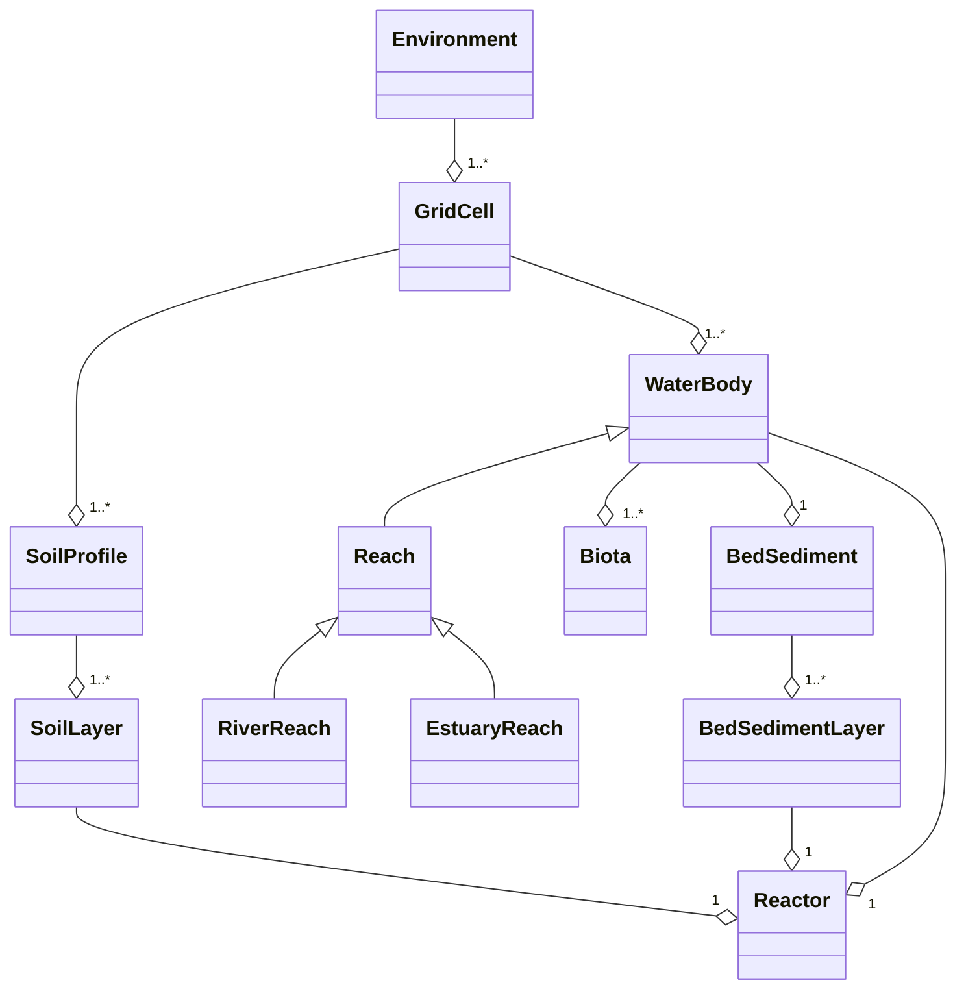

# Conceptual structure

Internally, the model represents the environment as a series of objects and their relationships, each representing different elements in the environment (rivers, soils, biota, etc) and their relationships. This can be represented on a UML diagram:

